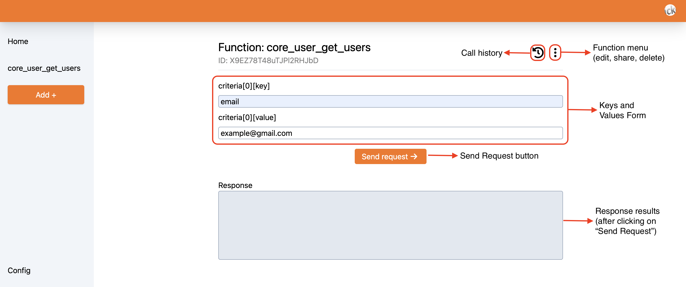

# What is?

Moodle API Handler is an open-source tiny app that helps to manage your [API functions from Moodle](https://docs.moodle.org/dev/Web_service_API_functions) (you can read more about Moodle WebServices [here](https://docs.moodle.org/dev/Web_service_API_functions)). Here's what you can do:

> [!IMPORTANT]
> Users can only authenticate with a Google account.

- Create and save [API functions from Moodle](https://docs.moodle.org/dev/Web_service_API_functions) along with its input fields:

- Make an API request to your hosted Moodle.
- See a history of calls you made before and their responses.
- Configure the target Moodle App host and token.
- Share your Moodle APIs to other users.

# Tech Stack

- Sveltekit as Frontend
- Firebase as Backend (it uses Google Auth, Firestore, Cloud Storage).

# Installation

First, install all the dependencies with `npm install` (or `pnpm install` or `yarn`) and start a development server:

```bash
npm run dev

# or start the server and open the app in a new browser tab
npm run dev -- --open
```

Then, you can add your Firebase public configuration in an `.env` (inside the root folder) file similar as this:

```
PUBLIC_FIREBASE_APIKEY='xxxxxxxxxxxxxxxxxxxxxxxxxxxxxxxxxxxxxxx'
PUBLIC_FIREBASE_AUTHDOMAIN='xxxxxxxxxxxxxxxxxxxxxxxxxxxxxxxxx'
PUBLIC_FIREBASE_DATABASEURL='xxxxxxxxxxxxxxxxxxxxxxxxxxxxxxxxxxxxxxxxxxxxxxxxxxxxx'
PUBLIC_FIREBASE_PROJECTID='xxxxxxxxxxxxxxxxx'
PUBLIC_FIREBASE_STORAGEBUCKET='xxxxxxxxxxxxxxxxxxxxxxxxxxxxx'
PUBLIC_FIREBASE_MESSAGINGSENDERID='xxxxxxxxxxxx'
PUBLIC_FIREBASE_APPID='xxxxxxxxxxxxxxxxxxxxxxxxxxxxxxxxxxxxxxxxx'
```
